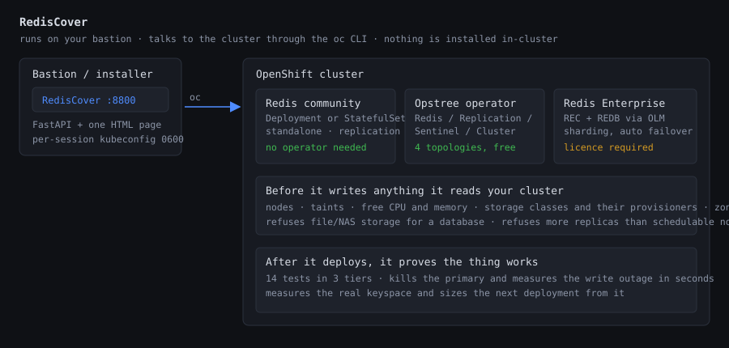
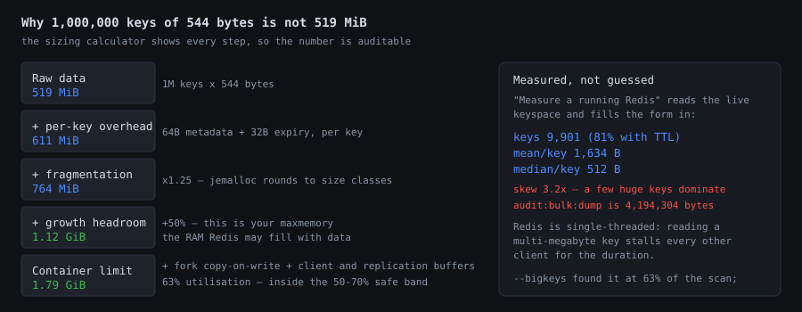

# RedisCover

**Deploy, size, test and inspect Redis on OpenShift — from one console.**

RedisCover runs on your bastion, logs into an OpenShift cluster, and gives you
three ways to run Redis: plain open-source Redis, the Opstree community
operator, or Redis Enterprise. It reads your actual cluster before it writes
anything, and it can prove the result works afterwards.



---

## ⚠️ Read this before running it

This tool **authenticates as you and acts with your privileges**. Logging in as
`kubeadmin` means it can do anything on the cluster, including delete
namespaces and persistent volumes.

* It binds to `127.0.0.1` by default. Setting `DEPLOYER_HOST=0.0.0.0` prints a
  warning — use an SSH tunnel instead.
* Your password is used once, for `oc login`, and is **never stored**. What
  persists is a per-session kubeconfig in `/tmp/rediscover-sessions`, mode
  `0600`, deleted on logout. Sessions expire after 8 hours.
* Passwords are stripped from every log line before display.
* Every cluster call goes through `app/ocp.py`. Nothing else shells out.
* There is **no authentication on the web UI itself** — anyone who can reach
  the port can use your session. Run it on a trusted host, behind a tunnel.

Destructive actions (deleting PVCs, deleting namespaces, killing pods) require
typing the release name to confirm.

---

## What it does

| Tab | |
|---|---|
| **Deploy** | Redis community, Opstree operator or Redis Enterprise. Topology- and version-driven forms, YAML preview, live deployment log. |
| **Cluster** | Nodes, roles, taints, zones, storage classes — with warnings about what will bite you. |
| **Sizing** | A calculator that shows its working, and a keyspace analyzer that fills it in from a running Redis. |
| **Operators** | Searches all packages in your cluster's catalog sources, not just Redis. Installs any of them. |
| **Test** | 14 tests in three tiers, including failure drills that measure the write outage. |
| **Status** | Live `INFO` from a running pod, plus pods, services, storage, policies and events. |
| **Uninstall** | Discovers what is installed and shows a per-object deletion plan before touching anything. |

### Screenshots

| | |
|---|---|
|  |  |
| Three products, described honestly | Sizing that shows its working |
|  |  |
| Failure drills with expected outcomes | Live `INFO`, not `oc get` output |

---

## Quick start

```bash
git clone https://github.com/bentech4u/RedisCover.git
cd RedisCover
./run.sh
```

First run creates a virtualenv and installs dependencies. Then open
<http://127.0.0.1:8800>.

From a laptop, tunnel rather than exposing the port:

```bash
ssh -L 8800:127.0.0.1:8800 user@bastion
```

**Requirements:** Python 3.9+, the `oc` CLI on `PATH`, and network access to
the cluster API. Nothing is installed into the cluster by the tool itself.

---

## Three ways to run Redis

| | Community | Opstree operator | Redis Enterprise |
|---|---|---|---|
| Licence | free (AGPL/RSAL) | free (Apache 2.0) | **commercial** |
| Image size | ~15 MB | ~100 MB | ~1.9 GB |
| Topologies | standalone, replication | standalone, replication, **Sentinel**, **cluster** | sharded + auto failover |
| Automatic failover | no | yes (Sentinel / cluster) | yes |
| Client changes needed | none | Sentinel- or cluster-aware | **none** — sharding sits behind a proxy |
| Minimum nodes | 1 | 1–6 | 3 |
| Support | community | community | vendor |

The community path is deliberately limited to **standalone and replication**.
Sentinel and Cluster are not hand-rolled here: writing failover election and
hash-slot management by hand means reimplementing an operator, badly. Use the
Opstree option for those — it is the same open-source Redis, with something
competent supervising it.

Replication says plainly in the UI that it has **no automatic failover**: if
the primary dies, Kubernetes restarts the same pod and the replicas reconnect,
but nothing promotes anyone in the meantime.

---

## Sizing, from measurement rather than guesswork



Redis holds everything in RAM; the disk only carries the AOF/RDB files. The
calculator makes the distinction explicit and shows every step, so the number
is auditable rather than magic.

**"Measure a running Redis"** reads the live keyspace — `INFO memory` for
authoritative totals, a `RANDOMKEY` sample for the distribution, and
`--bigkeys` for the outliers a sample will miss — then fills the form in.

It reports the findings that change a decision, not just numbers: heavily
skewed key sizes, multi-megabyte keys that stall the single-threaded event
loop, evictions in progress, a poor hit ratio, and the subtle one — a
`volatile-*` eviction policy when most keys have no TTL, which means Redis will
start **rejecting writes** rather than evicting.

---

## Testing

Three tiers by blast radius. Each test states its **expected result for your
topology** before you run it, so "writes failed for 6 seconds" reads as correct
behaviour rather than a bug.

**Tier 1 — Safe.** Auth enforced both ways · data types and TTL · configuration
actually loaded · persistence armed · replication linked with per-replica lag ·
propagation timing · replicas reject writes · cluster slot coverage ·
NetworkPolicy reachability.

**Tier 2 — Disruptive.** Hard-kill the primary, kill a replica, stop/start
cycle. Each seeds a known keyset first, so data loss is a **number**. It
measures the write outage — the figure your application team needs to size
retries and timeouts.

**Tier 3 — Load.** `redis-benchmark`, and an eviction test that fills past
`maxmemory` and asserts the policy does what you chose.

Tests run from a throwaway pod **inside** the cluster, never via
`port-forward` — port-forward tunnels through the API server and bypasses
NetworkPolicy, which would hide exactly the faults worth catching.

Reports are exportable as Markdown, with the measured outage timings in their
own table for a change ticket.

---

## What it checks before it writes anything

This is the part that makes it more than a YAML generator. Each of these was
added because it went wrong in real use:

* **File storage is refused for a database.** NAS and NFS handle `fsync` and
  file locking differently; the failure mode is corruption weeks later, not an
  error today. Requires an explicit override.
* **The default StorageClass is resolved and pinned** into the manifest, so
  what you got is recorded — a StatefulSet's `volumeClaimTemplates` are
  immutable, and landing on the wrong class can only be fixed by deleting and
  recreating.
* **An existing StatefulSet with a different storage class is detected**, because
  re-applying would silently change nothing.
* **NetworkPolicies select on `kubernetes.io/metadata.name`**, which Kubernetes
  sets automatically, rather than a hand-rolled label that usually does not
  exist — a `namespaceSelector` matching nothing denies *all* ingress.
* **Peer traffic is allowed**, or a multi-pod topology deadlocks: replicas
  cannot reach the primary, Sentinel cannot monitor, the cluster bus cannot
  gossip.
* **More replicas than schedulable nodes is refused** — operators use *required*
  pod anti-affinity, so the extras would sit `Pending` forever.
* **`maxmemory` versus the container limit is checked live** as you type. Unset
  `maxmemory` means Redis grows until the kernel OOMKills it — a crash, not an
  eviction.
* **Custom resources are validated against the installed CRD schema** before
  applying, then server-side dry-run. Community operators rename fields between
  releases.

---

## Limitations

* **Redis Enterprise requires a licence.** Without one the cluster runs in
  trial mode: 4 shards, 30 days.
* **Opstree CR fields** are generated from that operator's documentation
  (v0.15.x, `v1beta2`). The app reads the installed CRD schema and warns about
  fields it does not declare, then lets the server-side dry run decide — but a
  renamed field in a version I have not seen will surface as a rejection.
* **Community mode is standalone or replication only.** See above.
* **Sessions live in memory.** Restarting the app logs everyone out.
* **The UI has no authentication of its own.** See the security section.
* Tested against OpenShift 4.22. Earlier 4.x should work; nothing depends on
  4.22-specific APIs.

---

## Layout

```
app/ocp.py          oc CLI wrapper — login, apply, jsonpath, wait_for
app/catalog.py      version catalogue and the feature flags that drive the forms
app/models.py       pydantic request models
app/manifests.py    all manifest generation; nothing is applied from elsewhere
app/opstree.py      Opstree custom resources + live CRD schema reads
app/discover.py     finds what is already installed, and the leftovers
app/operators.py    OperatorHub search over a cached index
app/redistests.py   the test suite: registry, runner, report
app/analyze.py      keyspace analyzer
app/deploy.py       job runner and the deployment orchestrations
app/main.py         FastAPI routes, sessions, SSE log streaming
app/static/         single-page UI, no build step
```

---

## Contributing

Issues and pull requests welcome. If you hit a case where a generated manifest
is wrong for your cluster, the YAML preview and the deployment log are the most
useful things to attach.

## Licence

Apache 2.0 — see [LICENSE](LICENSE).

## Trademarks

Not affiliated with, endorsed by, or sponsored by Redis Ltd or Red Hat, Inc.
Redis is a trademark of Redis Ltd. OpenShift and Red Hat are trademarks of
Red Hat, Inc. Names are used descriptively to identify the software this tool
works with.
